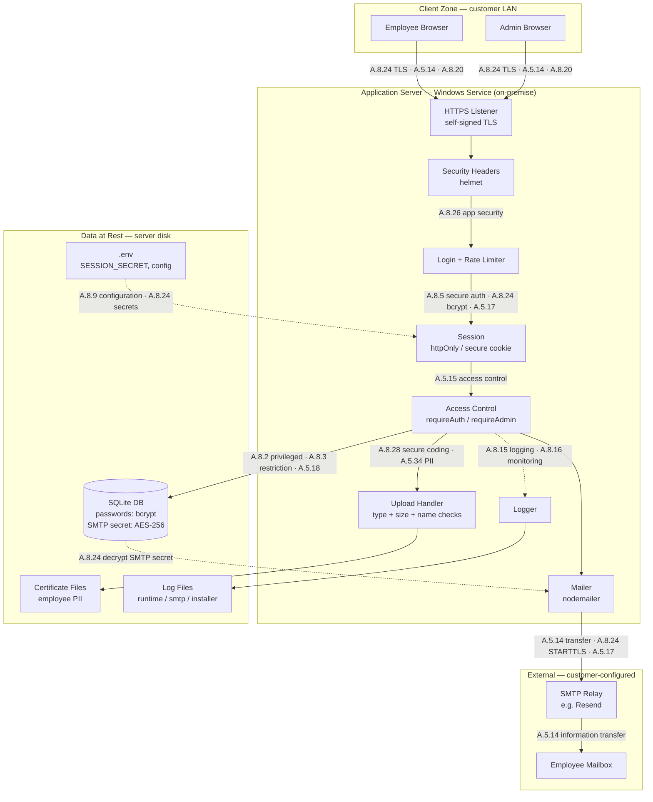

# Data Flow & Control Map

**Reference diagram for auditors and integrators.**
Version 1.0 · Maps to ISO/IEC 27001:2022 Annex A.

This document shows **where data goes** inside Offset Aware and
**which control guards each hop**. It is built from the actual application code
(`server.js`, `logger.js`, `setup.ps1`), not from a template — every control
below points to a real mechanism in the product.

Aware is a single **on-premise Windows service**. No data leaves the
customer network except outbound email, which the customer configures.

---

## 1. Data flow diagram

> If the diagram does not render, view this file on GitHub (native Mermaid) or
> in any Mermaid-aware viewer.

---

## 2. Hop-by-hop control map

| # | Hop (data path) | Data in transit | Guarding control(s) | Where in code |
|---|---|---|---|---|
| 1 | Browser → Server | Credentials, form data, the staff list, session cookie | **A.8.24** Use of cryptography (TLS), **A.5.14** Information transfer, **A.8.20** Networks security | HTTPS server, self-signed until the administrator uploads the company's certificate (`tls.js`); plain HTTP on the same port is redirected; firewall rule (`setup.ps1`) |
| 2 | Request → Security headers | All HTTP responses | **A.8.26** Application security requirements | `helmet()` with a Content-Security-Policy; cross-site changes refused (`server.js`) |
| 3 | Login → Auth check | `emp_id` + password | **A.8.5** Secure authentication, **A.8.24** (bcrypt hash), **A.5.17** Authentication information | `bcrypt.compare`, `loginLimiter` (`server.js:102`, `:224`) |
| 4 | Auth → Session | Session ID cookie (httpOnly, secure, sameSite, 8h) | **A.8.5** Secure authentication, **A.5.15** Access control | `express-session`, renewed at each sign-in (`server.js`) |
| 5 | Request → Authorization | Role / identity check | **A.8.2** Privileged access rights, **A.8.3** Information access restriction, **A.5.18** Access rights, **A.5.15** Access control | `requireAuth`, `requireAdmin` (`server.js:211-217`) |
| 6 | Upload → Memory | The staff list, CSV (PII) | **A.5.34** PII protection, **A.8.26** (type allowlist, size limit) | `multer` memoryStorage + `ALLOWED_UPLOAD_TYPES` (`server.js`); never written to disk |
| 7 | App → Database | User records, training records, settings | **A.8.24** Cryptography (bcrypt passwords, AES-256 SMTP secret), **A.8.3** Information access restriction | `encryptSmtpPass` AES-256-GCM (`server.js`); SQLite (`server.js:169`) |
| 8 | App → SMTP relay | Password resets, temp passwords, notifications, login link | **A.5.14** Information transfer, **A.8.24** (STARTTLS), **A.5.17** Authentication information | `nodemailer` transporter (`server.js:121`); `PORTAL_URL` link |
| 9 | App → Log files | Runtime events, SMTP events, errors (no secrets) | **A.8.15** Logging, **A.8.16** Monitoring activities | `logger.js` (`logRuntime`, `logSmtp`) |
| 10 | Config → App | `SESSION_SECRET`, `PORT`, `PORTAL_URL` | **A.8.9** Configuration management, **A.8.24** (secret generation) | `.env` written by `setup.ps1`; `dotenv` (`server.js:1`) |

---

## 3. Identity & account lifecycle controls

These act on the admin paths (user provisioning, password reset) rather than a
single hop:

| Control | Where |
|---|---|
| **A.5.16** Identity management | Admin creates employee accounts (`POST /api/admin/users`) |
| **A.5.17** Authentication information | Temp passwords emailed; `require_password_change` forces reset on first login |
| **A.5.18** Access rights | `role` column (`employee` / `admin`) enforced by `requireAdmin` |
| **A.8.2** Privileged access rights | All `/api/admin/*` routes gated by `requireAdmin` |

---

## 4. Data classification

| Data | Sensitivity | Protection at rest |
|---|---|---|
| Employee passwords | Secret | bcrypt hash (never stored plain) — A.8.24 |
| SMTP password / API key | Secret | AES-256-GCM encrypted in `settings` — A.8.24 |
| `SESSION_SECRET` | Secret | Generated per-install, stored in `.env`, readable by administrators only — A.8.9 |
| Quiz answers | Internal | On the server only; never sent to a browser — A.8.3 |
| Employee name / email / `emp_id` | PII | SQLite, admin-only read — A.5.34, A.8.3 |
| Training completion records | Internal | SQLite, access-controlled — A.8.3 |

---

## 5. Known control gaps / roadmap

Stated openly for audit credibility. These are **not yet** implemented and are
candidates for the next release:

| Area | Gap | Related control |
|---|---|---|
| Transport | Ships with a self-signed certificate (name = `localhost`), so browsers warn until an administrator uploads the company's own under Settings → HTTPS certificate. Nothing forces that upload. | A.8.24 |
| Web hardening | The Content-Security-Policy allows inline scripts, because the UI uses them. Outside scripts, connections and framing are blocked. Revisit with a nonce-based policy. | A.8.26 |
| Sign-in | No second factor, and no check of new passwords against known-breached lists. | A.8.5 |
| Backup | No built-in backup/restore of the data folder. Customer must back it up. | A.8.13 |
| Key management | AES key derived from `SESSION_SECRET`; no key rotation. | A.8.24 |
| Audit trail | Logs cover errors and SMTP, not full admin-action audit (who deleted/reset whom). | A.8.15 |
| Integration API | Token-authed read API is **designed** (see `INTEGRATION_API.md`) but not yet built. | A.8.5, A.5.15 |

---

## 6. Control coverage summary

Controls demonstrably exercised by the product today:

`A.5.14` · `A.5.15` · `A.5.16` · `A.5.17` · `A.5.18` ·
`A.8.2` · `A.8.3` · `A.8.5` · `A.8.9` · `A.8.15` · `A.8.16` ·
`A.8.20` · `A.8.24` · `A.8.26` · `A.8.28` · `A.5.34`

> **Scope note:** This map covers controls the *software* implements. A full
> ISO 27001 certification also requires organizational controls (policies, risk
> assessment, supplier management, physical security) that live outside this
> tool.
